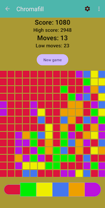

# Chromafill

Chromafill is a tile-based Android game. To play, tap colors from the palette at the bottom to flood fill the board from top left until the board is painted a solid color.

Although playable, this project is intended as an exercise in Android application programming using Views.
Any future verion of Chromafill will be Compose based rather than View based.

No `.apk` file is posted.
To install Chromafill, build this project with Android Studio Narwhal and launch.